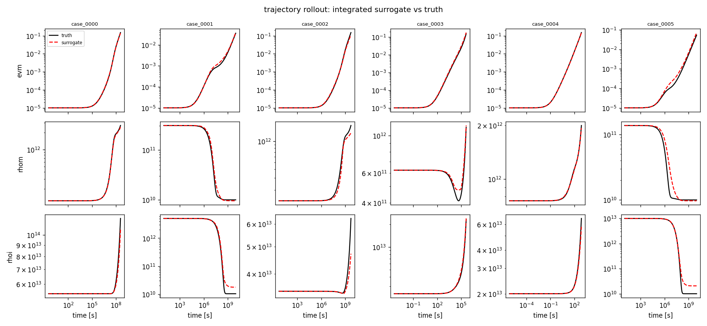
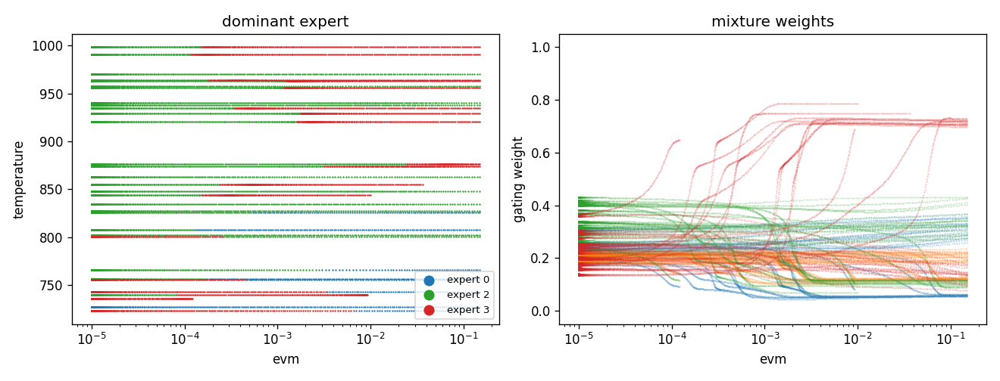

# Mixture-of-Experts Constitutive Surrogate

A complete, self-contained workflow for training a surrogate of a **constitutive
model** -- a differential equation whose right-hand side gives the rate of change
of a material's internal state -- as a `pypolymix` mixture of experts.

Unlike the other examples in this gallery, which are single notebooks, this one is
a small set of scripts you are meant to copy and point at your own data. It covers
the parts that a notebook usually skips: an on-disk data contract, transforms
fitted on the training split and versioned with the model, checkpointing and
resume, and an evaluation that integrates the learned right-hand side forward in
time.

Everything here is deterministic: every parameter group is a
`DeterministicGroup`, so the model learns a point estimate. That is deliberate.
A deterministic fit is the right first step, it is the natural initialization and
prior center for a stochastic fit, and it keeps the moving parts down while you
get your data plumbing right. [Going stochastic](#going-stochastic) below shows
the diff.

---

## The problem

A constitutive model is an ordinary differential equation in the material state,

$$
\frac{\mathrm{d}q}{\mathrm{d}t} = f(q, u),
$$

where $q$ is the internal state (here: equivalent creep strain and the mobile and
immobile dislocation densities) and $u$ the imposed controls (temperature, stress,
irradiation flux). Evaluating $f$ inside a finite-element solver is often far more
expensive than the structural solve around it, which is the motivation for
replacing $f$ with a surrogate.

The learning problem is ordinary supervised regression,

$$
x = [\,q,\ u\,] \in \mathbb{R}^{6}
\qquad\longmapsto\qquad
y = \dot q \in \mathbb{R}^{3},
$$

but the data is not ordinary. Across the operating envelope the strain rate spans
eleven orders of magnitude, the density rates change sign, and the material moves
between physically distinct regimes -- glide-dominated, climb-dominated,
recovery-dominated -- with sharp transitions between them.

**Why a mixture of experts.** A single network has to represent every regime with
one set of weights, and gradient descent trades them off against each other. A
mixture

$$
f(x) = \sum_{e=1}^{E} g_e(x)\, f_e(x),
\qquad
g(x) = \operatorname{softmax}\bigl(h(x)\bigr),
$$

lets a small gating network $h$ partition the input space and lets each expert
$f_e$ specialize. The partition is learned, not imposed, and you can read it off
afterwards -- see the gating figure below, where one expert takes over past a
strain of roughly $10^{-3}$ and another owns the low-temperature branch.

**Why `pypolymix`.** `MixtureOfExperts` is already vectorized over parameter
samples, and the parameter vector is supplied by a list of parameter groups rather
than living inside the modules. That indirection costs nothing here and is what
makes the stochastic extension a local change instead of a rewrite.

---

## Quickstart

```bash
pip install "pypolymix[examples]"
cd docs/examples/constitutive_model

python data.py --out toy_data                                # ~30 s
python train.py --data-dir toy_data --run-dir runs/demo      # ~2 min on one GPU
python evaluate.py --run-dir runs/demo                       # ~1 min
```

`data.py` synthesizes a dataset so the example runs with no data at hand; skip it
if you have your own (see [Bring your own data](#bring-your-own-data)). Every knob
is a flag derived from the `Config` dataclass in [config.py](config.py); run
`python train.py --help` to see all of them.

Defaults produce a 4-expert mixture with **52,672 parameters in 44 parameter
groups**, trained for 150 epochs at roughly 0.65 s/epoch. It also trains fine on
CPU, just slower -- add `--device cpu --batch-size 1024`.

---

## Results on the synthetic dataset

| output     | one-step raw NRMSE | rollout median log₁₀ RMSE |
| ---------- | -----------------: | ------------------------: |
| `devm_dt`  |              0.080 |                     0.048 |
| `drhom_dt` |              0.236 |                     0.036 |
| `drhoi_dt` |              0.243 |                     0.019 |

The right-hand column is the one that matters: it is the error after integrating
the *learned* right-hand side over a full held-out trajectory, in decades of the
state variable. A log₁₀ RMSE of 0.02–0.05 is a 5–12 % error in the state after the
model has been driven by its own predictions across up to ten decades of time.



*Six held-out cases. Black is the reference trajectory, red is the surrogate
integrated from the same initial state under the same controls.*



*The learned partition. Left: which expert dominates, over strain and temperature.
Right: the mixture weights themselves. The gate discovered the strain threshold
and the temperature branch on its own; nothing in the loss asked it to.*

---

## Bring your own data

`train.py` and `evaluate.py` read this layout and nothing else.

```text
<data_dir>/
  meta.json                      names, state/control split, row counts
  train/X.npy   (N, 6) float32   val/X.npy   test/X.npy     (test optional)
  train/Y.npy   (N, 3) float32   val/Y.npy   test/Y.npy
  rollout/case_0000.npz          {"t": (T,), "X": (T, 6)}   (optional)
  rollout/case_0001.npz          ...
```

| file            | shape     | dtype     | contents                                    |
| --------------- | --------- | --------- | ------------------------------------------- |
| `X.npy`         | `(N, 6)`  | `float32` | one row per sample, `[state, controls]`     |
| `Y.npy`         | `(N, 3)`  | `float32` | the matching `dq/dt`                        |
| `case_*.npz/t`  | `(T,)`    | `float64` | strictly increasing clock for one trajectory |
| `case_*.npz/X`  | `(T, 6)`  | `float64` | the reference trajectory and its controls   |

`meta.json`:

```json
{
  "input_names":  ["evm", "rhom", "rhoi", "temperature", "stress", "flux"],
  "output_names": ["devm_dt", "drhom_dt", "drhoi_dt"],
  "state_indices": [0, 1, 2]
}
```

`state_indices[j]` is the column of `X` holding the state whose rate is output
`j`. **This is the only structural assumption in the example.** One-step training
does not need it, but it is what lets `evaluate.py` close the loop and integrate
the model, and it is what the `d log10(q)/dt` change of variable in
[transforms.py](transforms.py) keys off. Controls are whatever columns are left
over.

Practical notes:

- Rows are read through `np.load(..., mmap_mode="r")`, so `X.npy` may be far
  larger than memory. Shuffle once when you write the file; the loader shuffles
  indices, and random access into a memory-mapped array on spinning storage is
  slow.
- **Split by case, not by row.** Rows from one trajectory are highly correlated;
  splitting them randomly gives a validation loss that looks great and means
  nothing. `data.py` assigns whole cases to splits, which is why the training loss
  here settles roughly an order of magnitude below the validation loss.
- Rollout cases should be genuinely held out -- not in `train/` in any form.
- Different input/output widths work: pass `--num-inputs`/`--num-outputs` and
  adjust `--state-indices`, `--log-input-columns`, `--output-powers`. The
  defaults assume the 6/3 layout above.

---

## Choosing a transform

Raw constitutive rates are hostile to a mean-squared error. In the toy dataset
`devm_dt` spans `1e-15` to `3e-4`; an unweighted MSE on those numbers optimizes
the largest thousand rows and ignores everything else.

[transforms.py](transforms.py) provides a pair that works well on creep data:

| stage |                                                  | why |
| ----- | ------------------------------------------------ | --- |
| in 1  | `log10` on the strictly positive input columns    | eight decades of state become an interval of width ~8 |
| in 2  | median / IQR centering                            | robust to the tails that survive the log |
| out 1 | `dq/dt -> d log10(q)/dt = (dq/dt)/(q ln 10)`      | removes the *state's* dynamic range from its own rate |
| out 2 | signed power `sign(v) * abs(v)**p`, small `p`     | compresses the remaining decades, keeps the sign and the zero |
| out 3 | median / IQR centering                            | puts all three outputs on the same footing in the loss |

**These are a suggestion, not a universal recipe.** They encode assumptions --
that the logged inputs are strictly positive, that a rate divided by its own state
is better behaved, that the residual distribution is heavy-tailed and symmetric
about zero. Check them:

- Histogram your transformed targets. You want something roughly bell-shaped. A
  spike at zero with long tails means `p` is too large; a broad plateau means it
  is too small and you are amplifying near-zero noise.
- `transforms.suggest_power(y[:, j])` automates that judgment crudely, by
  minimizing excess kurtosis over `p = 1/1 ... 1/24`. `data.py` prints its
  suggestion for the generated data. The defaults here (`1/11, 1/7, 1/7`) came
  from that; a real creep dataset wanted `1/15, 1/11, 1/15`.
- If your rates are not heavy-tailed, `StandardizeInput`/`StandardizeOutput` are
  drop-in replacements. Swap them in `suggested_pair()` and retrain -- the
  comparison is worth doing once on your own data rather than taking the table
  above on faith.
- Writing your own means subclassing `InputTransform` or `OutputTransform`
  (`fit`, `forward`, `config`, plus `inverse` for outputs) and decorating it with
  `@transforms.register` so it round-trips through `transforms.json`.

> **The fitted transform is part of the model.** It is written to
> `<run_dir>/transforms.json` on the first epoch and reloaded on every resume and
> evaluation. Deleting or refitting it silently invalidates every checkpoint in
> that directory: the weights were trained against one normalization and will be
> applied under another, and nothing raises. If you change transform settings,
> use a new run directory.

Statistics are fitted on at most `--fit-max-rows` (default 10⁶) sampled training
rows. Robust quantiles converge long before that; there is no reason to stream
hundreds of millions of rows.

---

## How the model is built

[model.py](model.py) is about eighty lines and uses `pypolymix` components
unmodified:

```python
experts   = [NeuralNetwork(6, 3, width=64, depth=4, activation=F.silu) for _ in range(4)]
gate      = GatingNetwork(6, num_experts=4, width=16, depth=1, activation=F.silu)
surrogate = MixtureOfExperts(experts, gate)
model     = StochasticModel(surrogate, groups)
```

The parameter vector is flat and is sliced by position:

```text
[ expert 0 | expert 1 | expert 2 | expert 3 | gate ]
  13,123     13,123     13,123     13,123     180     = 52,672 scalars

each expert = [ W0 b0 | W1 b1 | W2 b2 | W3 b3 | W4 b4 ]   -> 10 groups
each gate   = [ W0 b0 | W1 b1 ]                           ->  4 groups
                                                     total  44 groups
```

Two important remarks:

**One group per layer, not one group for the whole mixture.**
`DeterministicGroup` initializes itself as `torch.randn(n)` -- unit variance,
regardless of layer shape. A depth-4 network seeded that way saturates its
activations immediately and does not train. Splitting the vector into one group
per weight matrix and one per bias lets `network_groups()` seed each with the
distribution `torch.nn.Linear` would have used, which for the Kaiming default
`a = sqrt(5)` is just `U(-1/sqrt(fan_in), +1/sqrt(fan_in))` for weights *and*
biases. The split is also the handle for making part of the model stochastic
later.

**Group order must match the surrogate's slicing.** `StochasticModel`
concatenates groups in list order; `MixtureOfExperts` slices experts in order with
the gate last. `StochasticModel` validates the total parameter count but not the
order, so a permutation trains to garbage without any error. If you reorder the
loop in `build_moe()`, reorder the slices too.

Changing the architecture is a flag: `--num-experts`, `--expert-width`,
`--expert-depth`, `--gate-width`, `--gate-depth`, `--activation`. The experts here
are constant-width because that is what `pypolymix.NeuralNetwork` provides; a
tapered stack such as `[128, 64, 32, 16, 8]` is often a better use of the same
budget, and getting one is a matter of subclassing `SurrogateModel` with the same
`param_slices` convention -- `NeuralNetwork` is the template, and
`network_groups()` will consume the result unchanged.

---

## Training

The objective is the whole of it:

```python
loss = F.mse_loss(model(T_x(X)), T_y(X, Y))
```

No regularization term appears. `DeterministicGroup.distribution_loss()` exists
but is never called; shrinkage is AdamW's `--weight-decay`.

`AdamW` with `CosineAnnealingWarmRestarts` (`--coswr-t0 10 --coswr-tmult 2`). Warm
restarts suit this problem: each restart kicks the model out of the basin it
settled into, and with a mixture that often reshuffles which expert owns which
region. Set `--epochs` to `t0 * (tmult**k - 1) / (tmult - 1)` -- 10, 30, 70, 150,
310, ... -- to stop on a cycle boundary rather than mid-descent. The default of
150 is four complete cycles.

Checkpointing:

- `best.pt` tracks the lowest **validation** loss. In the run above that was
  epoch 70, the end of the third cycle -- not epoch 149.
- `last.pt` is written every epoch, and `train.py` **resumes from it
  automatically**, restoring model, optimizer and scheduler state. Re-running the
  same command continues; it does not start over. Delete the run directory to
  start over. Unlike some setups this announces the resume rather than doing it
  silently, but it is still the most common way to be confused by your own
  results.
- `metrics.csv` gets one row per epoch (`epoch, train_loss, val_loss, lr,
  seconds`).

Both checkpoints embed the full `Config` and `meta.json`, so `evaluate.py`
reconstructs the architecture without being told what it was.

---

## Evaluation

[evaluate.py](evaluate.py) asks two questions that do not have the same answer.

**One-step** error compares `f(x)` against the true `dq/dt` on held-out rows, in
both raw and transformed units, and writes `one_step.csv`. It is cheap and it is
exactly what the training loss optimizes -- which is why on its own it is not
evidence of much.

**Rollout** integrates `dq/dt = f(q, u)` from the initial state of a held-out
trajectory and compares against the reference, writing `rollout.csv`. Errors
compound, and after the first step the model is being asked about states it
generated itself. Integration is done in log-state,

$$
\frac{\mathrm{d}\log q}{\mathrm{d}t} = \frac{f(q, u)}{q},
$$

with `scipy.integrate.solve_ivp(method="LSODA")`. The log formulation keeps
positive states positive without a solver constraint and is far better
conditioned when the state moves over eight decades. It is also what makes the
whole thing tractable: a surrogate that is slightly non-smooth in raw units can be
impossible to integrate at all, and a case that fails to integrate is recorded as
`status=failed` rather than silently dropped.

Rollout is the slow part -- one forward pass per solver step at batch size one, so
it is dominated by dispatch overhead rather than arithmetic, and running it on CPU
is often faster than on GPU. Use `--rollout-cases` to bound it.

Figures go to `<run_dir>/figures/`: `parity.png`, `gating.png`, `rollout.png`.
`--no-figures` skips them.

---

## Going stochastic

The deterministic fit is a starting point. To get uncertainty in predictions,
change the parameter groups and add one term to the loss.

In `model.py`, swap the group constructor:

```python
from pypolymix.parameter_groups import IIDGaussianGroup

group = IIDGaussianGroup(name, num_params)
with torch.no_grad():
    group.mean.copy_(theta0)                                   # from the deterministic fit
    group.log_std.copy_(torch.log(0.1 * theta0.abs().clamp_min(1e-3)))
```

In `train.py`, average the data term over posterior draws and add the divergence:

```python
pred      = model(z_in, num_samples=num_samples)               # (S, batch, outputs)
data_loss = F.mse_loss(pred, z_target.expand_as(pred))
loss      = data_loss + model.distribution_loss()
```

Two important remarks:

1. **Make the prior match the parameter scale.** A shared `N(0, 1)` prior over
   weights whose magnitudes span five orders of magnitude is a strong and
   arbitrary statement. Either pass a per-group `GaussianPrior` centered on the
   deterministic fit, or reparameterize as `theta = theta0 + sigma0 * z` and learn
   `z` against a `N(0, I)` prior. The second is usually easier: the prior becomes
   scale-free, and the posterior starts at exactly `q = p` with zero divergence,
   so early training is driven by the data alone.
2. **You probably do not need every parameter to be stochastic.** Making only the
   gate and the last layer of each expert stochastic, with the rest frozen at the
   deterministic solution, captures most of the useful predictive spread at a
   fraction of the cost -- and evaluation cost scales linearly in the number of
   posterior draws.

Then see [Mixture of Experts](../moe.ipynb) for the stochastic MoE end to end,
[Custom Priors](../custom_priors.ipynb) for per-group priors, [Full
Covariance](../full_covariance.ipynb) and [Low Rank
Covariance](../low_rank_covariance.ipynb) for richer posteriors, and
[Theory](../../theo.md) for the derivation.

---

## Scaling up

The scripts are single-device on purpose. The real workflow this is distilled from
trained on 8.2 M rows across 8 GPUs.

- **Data.** One `.npy` per split stops being convenient past a few tens of GB.
  Shard it and index the shards; `DerivativeDataset.__getitem__` already takes a
  list of indices and returns a whole batch, which is the part that matters. Do
  not go back to fetching rows one at a time and collating -- that alone was worth
  about two orders of magnitude.
- **Distribution.** Wrap the model in `DistributedDataParallel`, add a
  `DistributedSampler`, and fit the transforms on rank 0 only, with the other
  ranks waiting on `transforms.json`. Every rank must use the same transform.
- **Throughput.** `--amp` (bfloat16 autocast) and a larger `--batch-size` are the
  first levers. Keep `--grad-clip`; mixture models occasionally produce a large
  gradient when the gate flips a region between experts.
- **Logging.** Do not use a progress bar under `nohup`. tqdm rewrites its line
  every step, and in a redirected log that becomes literal text -- an easy way to
  turn a training run into a multi-gigabyte log file.

---

## Files

| file                             | contents |
| -------------------------------- | --------: |
| [config.py](config.py)           | one dataclass with every knob; the CLI is derived from it |
| [data.py](data.py)               | on-disk contract, memory-mapped loader, synthetic generator |
| [transforms.py](transforms.py)   | transform protocol, the suggested pair, a plain alternative, `suggest_power` |
| [model.py](model.py)             | initialization, parameter groups, `build_moe()` |
| [train.py](train.py)             | training loop, checkpointing, resume |
| [evaluate.py](evaluate.py)       | one-step metrics, log-state rollout, figures |

Nothing outside this directory is imported except `pypolymix`, `numpy`, `scipy`,
`torch` and `matplotlib`. Copy the folder and start editing.
