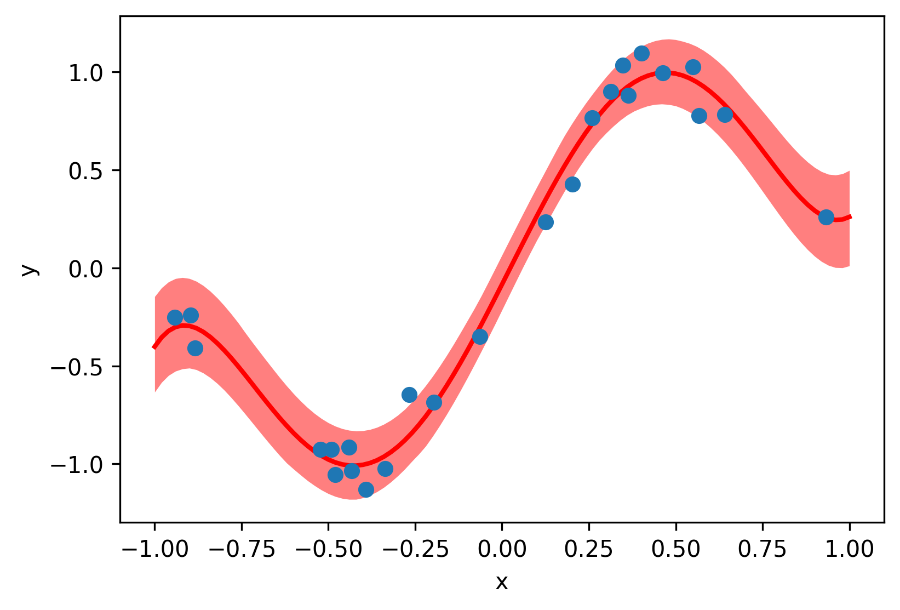

# Welcome to pypolymix

`pypolymix` is a light-weight PyTorch companion for building **stochastic surrogate
models**. Specify a deterministic surrogate architecture, attach variational parameter
groups, and let `pypolymix` handle sampling, broadcasting, and regularization.



## Key capabilities

- **Flexible surrogates:** Fully-connected networks, Polynomial Chaos expansions,
  Mixture-of-Experts, or any custom module that follows the `SurrogateModel` API.
- **Composable parameter groups:** Mix deterministic blocks and independent,
  low-rank, or full-covariance Gaussian families to approximate complex posteriors.
- **Prior-aware losses:** Every parameter group contributes a KL/cross-entropy
  term so you can tighten Bayesian objectives or regularize point estimates.

## Quick start

The notebooks in `examples/sine_1d` walk through training stochastic surrogates
on a noisy sine function. The core training loop looks like this:

```python
import torch
from pypolymix import StochasticModel, parameter_groups, surrogate_models

# Synthetic training data
num_samples = 25
train_x = 2 * torch.rand(num_samples, 1) - 1
train_y = torch.sin(torch.pi * train_x) + 0.1 * torch.randn(train_x.shape)

# Polynomial Chaos Expansion surrogate
surrogate = surrogate_models.PolynomialChaosExpansion(num_inputs=1, num_outputs=1, degree=5)

# Variational parameter group: IID Gaussian
group = parameter_groups.IIDGaussianGroup("nn", surrogate.num_params())

# Stochastic model
model = StochasticModel(surrogate, group)

# Training loop
optimizer = torch.optim.Adam(model.parameters(), lr=5e-3)
for step in range(1000):
    preds = model(train_x, num_samples=32) # (samples, batch, outputs)
    data_loss = ((preds.mean(0) - train_y) ** 2).mean()
    loss = data_loss + 1e-3 * model.distribution_loss()

    optimizer.zero_grad()
    loss.backward()
    optimizer.step()

# Evaluate the model
model.eval()
with torch.no_grad():
    test_x = torch.linspace(-1, 1, 101).unsqueeze(1)
    test_y = model(test_x, num_samples=1000)

# Plot prediction
import matplotlib.pyplot as plt
_, ax = plt.subplots()
plot_x = test_x.squeeze(-1)
quantiles = torch.quantile(test_y, torch.tensor([0.33, 0.5, 0.66]), axis=0).squeeze(-1)
ax.fill_between(plot_x, quantiles[0], quantiles[-1], color="red", alpha=0.5, linewidth=0)
ax.plot(plot_x, quantiles[1], color="red", linewidth=2)
ax.scatter(train_x, train_y, zorder=99)
ax.set_xlabel("x")
ax.set_ylabel("y")
plt.tight_layout()
```
